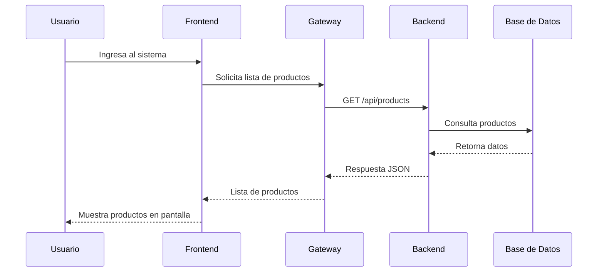

##  Diagrama de Secuencia – Consulta de Productos

```mermaid
sequenceDiagram

participant U as Usuario
participant F as Frontend
participant G as Gateway
participant B as Backend
participant D as Base de Datos

U->>F: Ingresa al sistema
F->>G: Solicita lista de productos
G->>B: GET /api/products
B->>D: Consulta productos
D-->>B: Retorna datos
B-->>G: Respuesta JSON
G-->>F: Lista de productos
F-->>U: Muestra productos en pantalla
```