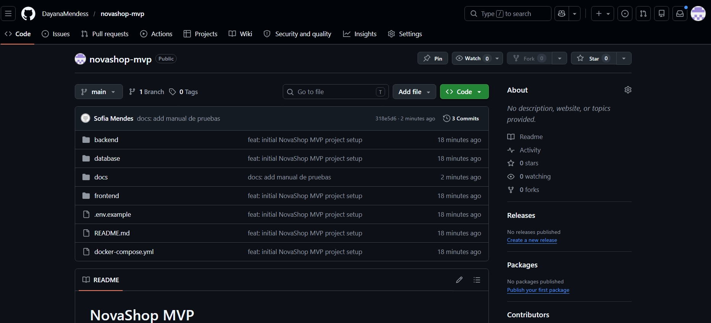
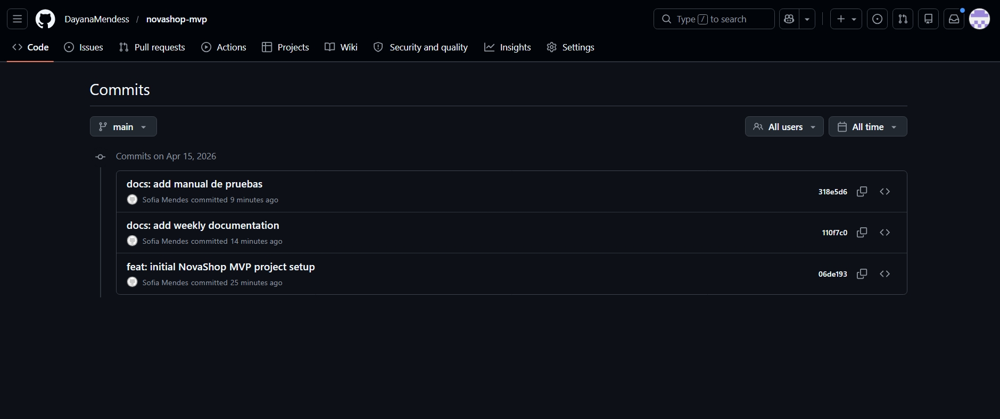
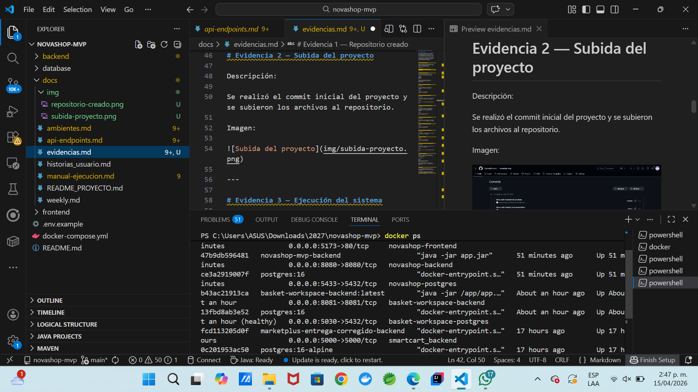
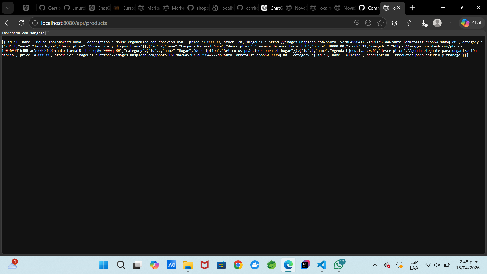
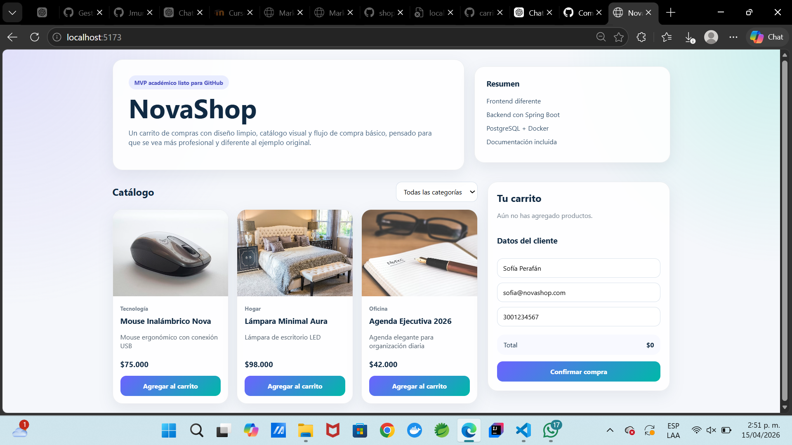

# 📂 Evidencias GitHub – NovaShop MVP

## 📑 Introducción

El presente documento reúne las evidencias del desarrollo del proyecto **NovaShop MVP**, demostrando el uso del control de versiones mediante Git y GitHub, así como la ejecución del sistema utilizando Docker.

Las evidencias incluidas en este documento permiten validar el progreso del proyecto, la organización del repositorio y la correcta ejecución del sistema.

---

# Creación del repositorio

Se creó el repositorio del proyecto en la plataforma GitHub para almacenar el código fuente, la documentación y las configuraciones del sistema.

Repositorio:

https://github.com/DayanaMendess/novashop-mvp

---

# Estructura del repositorio

El proyecto NovaShop MVP se encuentra organizado en las siguientes carpetas:

backend  
frontend  
database  
docs  

Esta estructura permite mantener el proyecto organizado y facilitar su mantenimiento.

---

# Evidencia 1 — Repositorio creado

Descripción:

Se creó el repositorio en GitHub y se configuró la estructura inicial del proyecto.

Imagen:

---

# Evidencia 2 — Subida del proyecto

Descripción:

Se realizó el commit inicial del proyecto y se subieron los archivos al repositorio.

Imagen:

---

# Evidencia 3 — Ejecución del sistema

Descripción:

Se ejecutó el sistema utilizando Docker, permitiendo levantar los contenedores necesarios para el funcionamiento del sistema.

Imagen:

---

# Evidencia 4 — Backend funcionando

Descripción:

Se verificó el funcionamiento del backend mediante el acceso al endpoint del sistema.

URL:

http://localhost:8080/api/products

Imagen:

---

# Evidencia 5 — Frontend funcionando

Descripción:

Se verificó el funcionamiento del frontend del sistema en el navegador.

URL:

http://localhost:5173

Imagen:

---

# Evidencia 6 — Base de datos funcionando

Descripción:

Se verificó la conexión del sistema con la base de datos PostgreSQL.

---

# Control de versiones

Durante el desarrollo del proyecto se utilizó Git para el control de versiones del código fuente.

Se realizaron:

Commits  
Push  
Actualizaciones del proyecto  
Correcciones de errores  

Esto permitió mantener un historial de cambios y garantizar la trazabilidad del desarrollo.

---

# Conclusión

El uso de GitHub permitió gestionar el proyecto NovaShop MVP de manera organizada y eficiente.

Las evidencias presentadas demuestran que el sistema fue desarrollado, ejecutado y probado correctamente.